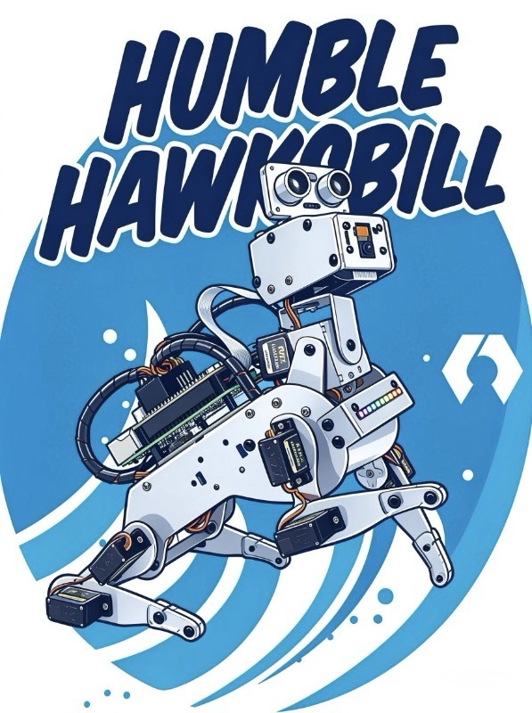

# 

# :mouse: ROS 2 Pi Dog Development on Raspberry Pi 5

<p align="center">
 
</p>

<p align="center">
<i>Technology is nothing. <br>
What's important is that you have a faith in people, <br>
that they're basically good and smart, and if you give them tools, <br>
they'll do wonderful things with them.</i><br><br>
&nbsp; &nbsp; &nbsp; &nbsp; &nbsp; &nbsp; &nbsp; &nbsp; &nbsp;
&nbsp; &nbsp; &nbsp; &nbsp; &nbsp; &nbsp; &nbsp; &nbsp; &nbsp;
&nbsp; &nbsp; &nbsp; &nbsp; &nbsp; &nbsp; &nbsp; &nbsp; &nbsp;
&nbsp; &nbsp; &nbsp; &nbsp; &nbsp; &nbsp; &nbsp; &nbsp; &nbsp; ― STEVE JOBS
</p> 

https://www.sunfounder.com/?ref=lbsberjr

## Table of Contents
- [Description](#scroll-description)
- [Development Platform Installation Procedure](#computer-development-platform-installation-procedure)
  - [Installation of Docker with Ubuntu 22.04 & ROS 2 Humble Core](#installation-of-docker-with-Ubuntu-22.04-&-ROS-2-Humble-Core)
  - [For Pi Dog Specific Recommended: Install Inside Container](#for-pi-dog-specific-recommended-install-inside-container)
- [Software Development](#floppy_disk-software-development)
- [Platform Tested](#iphone-platform-tested)
- [Screenshots](#film_strip-screenshots)
- [Chronology of Development Events](#hourglass_flowing_sand-chronology-of-development-events)
- [Buy Me a Coffee](#coffee-buy-me-a-coffee)
- [License](#page_with_curl-license)
- [Feedback and Suggestions](#speech_balloon-feedback-and-suggestions)

## :scroll: Description
Pi Dog Software Development with ROS 2 on Raspberry Pi 5 platform. The intent is to have SunFounder Pi Dog runs with ROS2. 

## :computer: Development Platform Installation Procedure

### Installation of Docker with Ubuntu 22.04 & ROS 2 Humble Core

On the Raspberry Pi 5:<br>
Part 1: Purging the Old Docker Installation

Since you have an existing Docker installation, we need to perform a complete removal to avoid conflicts with the new, official installation.

1. Remove Docker packages:
   Open a terminal on your Raspberry Pi and run the following command to remove all Docker-related packages installed via apt:
   ```bash
   sudo apt remove -y docker docker-engine docker.io containerd runc docker-compose
   ```
   (Note: The docker-compose package is the old, standalone version. The new installation includes the plugin docker compose.) 
2. Remove configuration and data:
   This step is crucial. It deletes all images, containers, and volumes. Warning: This will erase any existing Docker data you might want to keep. Since you want a fresh start, this is necessary.
   ```bash
   sudo rm -rf /var/lib/docker
   sudo rm -rf /var/lib/containerd
   ```
3. Remove the old repository link (if it exists):
   ```bash
   sudo rm -f /etc/apt/sources.list.d/docker.list
   sudo rm -f /etc/apt/keyrings/docker.asc
   ```

Part 2: Installing Docker Engine (Official Method)

We will install Docker using the official repository, which provides the latest version optimized for Debian ("Trixie").

1. Update your system:
   ```bash
   sudo apt update && sudo apt upgrade -y
   ```
2. Install prerequisites:
   ```bash
   sudo apt install -y ca-certificates curl
   ```
3. Add Docker's official GPG key and repository:
   ```bash
   # Create the keyrings directory
   sudo install -m 0755 -d /etc/apt/keyrings
   
   # Download the GPG key
   sudo curl -fsSL https://download.docker.com/linux/debian/gpg -o /etc/apt/keyrings/docker.asc
   sudo chmod a+r /etc/apt/keyrings/docker.asc
   
   # Add the repository to Apt sources
   echo "deb [arch=$(dpkg --print-architecture) signed-by=/etc/apt/keyrings/docker.asc] https://download.docker.com/linux/debian $(. /etc/os-release && echo "$VERSION_CODENAME") stable" | sudo tee /etc/apt/sources.list.d/docker.list > /dev/null
   ```
   (Note: $(. /etc/os-release && echo "$VERSION_CODENAME") will correctly resolve to trixie, for which Docker's bookworm repository is compatible.) 
4. Install Docker Engine:
   ```bash
   sudo apt update
   sudo apt install -y docker-ce docker-ce-cli containerd.io docker-buildx-plugin docker-compose-plugin
   ```
5. Verify the installation:
   ```bash
   sudo docker run hello-world
   ```
   If you see a welcome message, Docker is correctly installed.
6. Manage Docker as a non-root user (Recommended):
   To run docker commands without sudo, add your user to the docker group. You must log out and back in for this to take effect.
   ```bash
   sudo usermod -aG docker $USER
   ```
   After running this, close your terminal and open a new one. You can then test it with:
   ```bash
   docker run hello-world
   ```

Part 3: Creating and Installing ROS 2 Humble in a Docker Container

We will create a persistent container from an Ubuntu 22.04 base image, install ROS 2 Humble inside it, and then save this state as a new, reusable image.

1. Pull the base image:
   This pulls the official Ubuntu 22.04 (Jammy) image, which is the primary OS for ROS 2 Humble.
   ```bash
   docker pull ubuntu:22.04
   ```
2. Create and run the installation container:
   This command creates a new container named ros_humble_setup and gives you an interactive bash shell inside it.
   ```bash
   docker run -it --name ros_humble_setup ubuntu:22.04 /bin/bash
   ```
   Your terminal prompt will change, indicating you are now inside the container.
3. Install ROS 2 Humble inside the container:
   Run all of the following commands inside the container's terminal.
   · Set up locale:
     ```bash
     apt update && apt install -y locales
     locale-gen en_US en_US.UTF-8
     export LANG=en_US.UTF-8
     ```
   · Enable the Ubuntu Universe repository:
     ```bash
     apt install -y software-properties-common curl
     add-apt-repository universe
     ```
   · Add the ROS 2 GPG key and repository:
     ```bash
     curl -sSL https://raw.githubusercontent.com/ros/rosdistro/master/ros.key -o /usr/share/keyrings/ros-archive-keyring.gpg
     echo "deb [arch=$(dpkg --print-architecture) signed-by=/usr/share/keyrings/ros-archive-keyring.gpg] http://packages.ros.org/ros2/ubuntu $(. /etc/os-release && echo $UBUNTU_CODENAME) main" | tee /etc/apt/sources.list.d/ros2.list > /dev/null
     ```
     (If the curl command fails with a connection error, you may need to add 185.199.110.133 raw.githubusercontent.com to /etc/hosts inside the container.) 
   · Install ROS 2 Humble Desktop Full:
     This is the recommended suite for development, including tools like RViz and Gazebo.
     ```bash
     apt update
     apt install -y ros-humble-desktop-full
     ```
   · Install Colcon and other build tools:
     ```bash
     apt install -y python3-colcon-common-extensions ros-dev-tools
     ```
   · To install only the ROS 2 Humble Base (the minimal core without GUI tools like RViz, Gazebo, or demos), replace the ros-humble-desktop-full command with:

     ```bash
     apt update
     apt install -y ros-humble-ros-base
     ```

     What's the difference?

     | Package | Size | Includes |
     | ------- | ---- | -------- |
     | ros-humble-desktop-full | ~1.5 GB   | Everything:                    |
     |                         |           | ROS Base + RViz + Gazebo +     |
     |                         |           | pdemos + visualization tools.  |
     | ros-humble-ros-base     | ~300 MB   | Core ROS 2 |                         
     |                         |           | communication, launch files, |
     |                         |           | parameters, actions, lifecycle nodes |
     | ros-humble-ros-core     | ~100 MB   | Minimal: just DDS communication, |
     |                         |           | no build tools or launch system |

     For your Raspberry Pi 5, it is recommended:

     If you're developing on a headless Pi (no display) or want to save space:

     ```bash
     apt install -y ros-humble-ros-base
     ```

     If later need specific tools, install them individually:

     ```bash
     # Add build tools (essential for development)
     apt install -y python3-colcon-common-extensions ros-dev-tools

     # Add specific packages as needed
     apt install -y ros-humble-rviz2        # Only if you need visualization
     apt install -y ros-humble-turtlesim    # For learning/experiments
     apt install -y ros-humble-gazebo-ros-pkgs  # For simulation
     ```
4. Set up the ROS 2 environment:
   To make ROS 2 available every time you log into this container, source the setup script.
   ```bash
   echo "source /opt/ros/humble/setup.bash" >> ~/.bashrc
   source ~/.bashrc
   ```
5. Save the container as a new Docker image:
   This is the most important step for persistence. Exit the container by typing exit. Now, back on your Raspberry Pi's host terminal, commit the changes into a new image.
   ```bash
   docker commit ros_humble_setup ros2_humble:pi5
   ```
   You can now use this image ros2_humble:pi5 as your starting point for development. You no longer need the ros_humble_setup container.

Part 4: Developing ROS 2 Code (C++ & Python) and Saving Your Work

Now you'll create a workspace and learn how to save your code and installed dependencies permanently.

4.1 Running your ROS 2 Development Container

For development, you need to mount a folder from your Raspberry Pi into the container. This is where your code will live, safe from container deletion.

1. Create a workspace on your Raspberry Pi:
   On your host system (Raspberry Pi OS), create a folder for your ROS 2 workspace.
   ```bash
   mkdir -p ~/ros2_ws/src
   ```
2. Run the container with a mounted volume:
   This command starts your saved image, mounts your host's ros2_ws folder to /ros2_ws inside the container, and gives you a bash shell.
   ```bash
   docker run -it --name ros2_dev \
   --net=host \
   --privileged \
   -v /dev:/dev \
   -v /run/udev:/run/udev \
   -v /tmp/.X11-unix:/tmp/.X11-unix \
   -e DISPLAY=$DISPLAY \
   -v ~/ros2_ws:/ros2_ws \
   ros2_humble:pi5
   ```
   (To use graphical tools like RViz2 from the container, you may also need to run xhost + on your Raspberry Pi's host terminal before running the above command.)
3. Navigate to your workspace inside the container:
   ```bash
   cd /ros2_ws
   ```

4.2 Creating a Simple ROS 2 Package

1. Create a package:
   Inside the container, create a package. For C++:
   ```bash
   ros2 pkg create --build-type ament_cmake --node-name my_cpp_node my_cpp_package
   ```
   For Python:
   ```bash
   ros2 pkg create --build-type ament_python --node-name my_py_node my_py_package
   ```
2. Build the workspace:
   ```bash
   colcon build --packages-select my_cpp_package
   # Or for Python: colcon build --packages-select my_py_package
   ```
3. Source the workspace:
   ```bash
   source install/setup.bash
   ```
4. Run your node:
   ```bash
   ros2 run my_cpp_package my_cpp_node
   ```

4.3 Saving Your Development Progress (Crucial!)

Your code is safe because it's in the ~/ros2_ws folder on your Raspberry Pi. However, if you install additional Linux packages (e.g., vim, git, ros-humble-turtlesim) or Python libraries (e.g., pip install numpy) inside the container, you must save the container's state.

How to save the container with new installations:

1. Exit the container by typing exit.
2. Commit the changes from your running container (ros2_dev) to your Docker image (ros2_humble:pi5).
   ```bash
   docker commit ros2_dev ros2_humble:pi5
   ```
   The next time you run docker run ... ros2_humble:pi5, all your installed tools and dependencies will be there.

Part 5: Complete Backup and Restore Procedure

To move your entire setup to another SD card or computer, you can save your Docker image as a .tar file.

· To Backup (Save) the Image:
  ```bash
  docker save -o ros2_humble_pi5_backup.tar ros2_humble:pi5
  ```
  This creates a single file in your current directory.
· To Restore (Load) the Image:
  On a new system with Docker installed, copy the .tar file and load it:
  ```bash
  docker load -i ros2_humble_pi5_backup.tar
  ```
  Remember to also copy your ~/ros2_ws folder, as it is not inside the Docker image.

Summary of Commands for Your Daily Workflow

Here is your simplified workflow for future sessions:

1. Start the container for development (from your Raspberry Pi host terminal):
   ```bash
   xhost + # Only needed if using GUI tools like RViz
   docker start ros2_dev
   docker exec -it ros2_dev bash
   cd /ros2_ws
   ```
2. Stop the container when you are done:
   ```bash
   exit # To leave the container's shell
   docker stop ros2_dev
   ```
3. Save new installations inside the container (run this on your host after exiting the container):
   ```bash
   docker commit ros2_dev ros2_humble:pi5
   ```

### For Pi Dog Specific Recommended Install Inside Container

Since PiDog requires direct hardware access, installing the libraries inside the container is cleaner:

```bash
# Inside your Ubuntu 22.04 container
sudo apt update
sudo apt install python3-pip python3-venv i2c-tools python3-smbus

git clone -b 2.5.x https://github.com/sunfounder/robot-hat.git --depth 1
cd robot-hat 
sudo PIP_BREAK_SYSTEM_PACKAGES=1 python3 install.py

git clone https://github.com/sunfounder/vilib.git
cd vilib 
sudo PIP_BREAK_SYSTEM_PACKAGES=1 python3 install.py

git clone https://github.com/sunfounder/pidog.git --depth 1
cd pidog
sudo vi /pidog/pidog/pidog.py
# edit line 99: change from SOUND_DIR = f"{UserHome}/pidog/sounds/" to SOUND_DIR = f"/pidog/sounds/". This is so that /pidog/sounds/ folder path is correct in Docker environment. Save and exit the file.
sudo pip3 install . --break-system-packages

# If there is issue that the package installed with a generic name "UNKNOWN" instead of "pidog".
# First, uninstall the incorrect "UNKNOWN" package:
sudo pip3 uninstall UNKNOWN -y

# Now install properly with explicit package name:
sudo pip3 install --no-cache-dir .

cd ~/robot-hat
sudo bash i2samp.sh
```
When running /pidog/examples files if there is module not found then install the missing modules
```bash
sudo pip3 install tenacity
```
When running pidog example file if encounter the error cannot import name 'StrEnum' from 'enum' occurs because StrEnum was introduced in Python 3.11, but your Raspberry Pi is running Python 3.10. This is a compatibility issue with the pidog library.

Solution: Create a compatibility shim (Quick fix)

Create a file to add StrEnum support for Python 3.10:
```bash
sudo nano /usr/local/lib/python3.10/dist-packages/pidog/compat.py
```
Add this content:

```python
import sys

if sys.version_info < (3, 11):
    from enum import Enum
    import typing
    
    class StrEnum(str, Enum):
        """StrEnum for Python 3.10 compatibility"""
        def __new__(cls, value):
            obj = str.__new__(cls, value)
            obj._value_ = value
            return obj
        
        @property
        def value(self):
            return self._value_
        
        def __str__(self):
            return self._value_
else:
    from enum import StrEnum
```

Now edit the dual_touch.py file:

```bash
sudo nano /usr/local/lib/python3.10/dist-packages/pidog/dual_touch.py
```

Change line 4 from:

```python
from enum import StrEnum
```

To:

```python
from pidog.compat import StrEnum
```

Save and exit (Ctrl+X, then Y, then Enter).<br>
💬 Note: You may need to modify few others files that import StrEnum!

The robot-hat library handles the low-level hardware communication, which is why the --privileged flag and /dev mount are essential.

⚠️ Critical Hardware Flags

Regardless of your approach, these Docker flags are mandatory:
```
· --privileged — Full hardware access
· -v /dev:/dev — Access to GPIO, I2C, PWM devices
· -v /run/udev:/run/udev — Device management
· --net=host — Network access for ROS2
```

## :floppy_disk: Software Development:
I have tested on Raspberry Pi 5 running VSCode.
    
Project Structure

```
ros2_ws/
├── src/
│   └── pidog_ros2/
│       ├── pidog_ros2/
│       │   ├── __init__.py
│       │   ├── ros2_autonomous_pidog.py
│       │   ├── pidog_movement_node.py
│       │   ├── pidog_distance_node.py
│       │   ├── pidog_camera_node.py
│       │   ├── pidog_imu_node.py
│       │   ├── pidog_dual_touch_node.py
│       │   ├── pidog_direction_sensor_node.py
│       │   ├── pidog_tts_speaks_node.py
│       │   └── pidog_stt_voice_command_node.py
│       ├── launch/
│       │   └── pidog_autonomous.launch.py
│       ├── config/
│       │   └── pidog_params.yaml
│       ├── setup.py
│       ├── setup.cfg
│       ├── package.xml
│       ├── resource/
│       │   └── pidog_ros2
│       ├── msg/
│       │   ├── Distance.msg
│       │   ├── IMUData.msg
│       │   ├── TouchData.msg
│       │   ├── SoundDirection.msg
│       │   ├── FaceDetection.msg
│       │   └── CommandStatus.msg
│       └── srv/
│           ├── MoveCommand.srv
│           ├── SpeakCommand.srv
│           └── EnableSoundDirection.srv
```

Some useful information:
``` 
Servos Order
                     4,
                   5, '6'
                     |
              3,2 --[ ]-- 7,8
                    [ ]
              1,0 --[ ]-- 10,11
                     |
                    '9'
                    /

    legs pins: [2, 3, 7, 8, 0, 1, 10, 11]
        left front leg, left front leg
        right front leg, right front leg
        left hind leg, left hind leg,
        right hind leg, right hind leg,

    head pins: [4, 6, 5]
        yaw, roll, pitch
		PiDog Head Movement Axes
		- Yaw (No. 4 servo): Rotates the head left and right (turning).
		- Roll (No. 6 servo): Tilts the head side-to-side (ear-to-shoulder).
		- Pitch (No. 5 servo): Moves the head up and down (nodding).
		Example:
			shake_head = [[30, 0, 0],[-30, 0, 0]]
			nod_head = [[0, 0, 30],[0, 0, -30]]

    tail pin: [9] 

```
## :iphone: Platform tested:
I have tested my code on:
- Raspberry Pi 5

## :film_strip: Screenshots
<p float="left">
  
</p>

## :hourglass_flowing_sand: Chronology of Development Events
- 20th Apr 2026: Started to Googled and read up on how to install ROS 2 on a Raspberry Pi 5. Tried many promising website but eventually none worked for my system setup.
Raspberry Pi 5 runs on Debian 13 (Trixie) OS but ROS 2 Humble Hawksbill middleware needs Ubuntu 22.04 (Jammy Jelly).
So a lot of websites mentioned the need to install Docker to run Ubuntu 22.04 and then install ROS2.
Finally after making few attempts I gave up and ask DeepSeek with the following prompt.
```
The system I am using is Raspberry Pi 5 running Trixie OS. 
Please provide the whole installation procedure of Docker
(I need Docker to run Ubuntu 22.04). I have installed Docker on 
the system so need to remove before installing new Docker with Ubuntu 22.04. 
After Docker is ready please provide the procedure for installing ROS 2 Humble in docker. 
After that provide the whole procedure to develop ROS 2 Python and C++ code on Docker 
and how to make sure that all the installation and code created in Docker are saved 
so that it can be loaded back when  Docker is running back.
```
 &nbsp; &nbsp;  &nbsp; Amazingly DeepSeek was able to provide me step by step installation that works. <br>
 &nbsp; &nbsp;  &nbsp; You can refer to the [Development Platform Installation Procedure](#computer-development-platform-installation-procedure) above for details.
- 21th Apr 2026: Finally able to get ROS 2 up and running. 
- 30th Apr 2026: Managed to install robot-hat and pidog into Docker with  Ubuntu 22.04. 
However still facing some problem with Vilib installation. Couldn't get the camera to be working.
Installation of robot-hat and pidog not so straightforward and need to manually install some of the dependencies files in order for it to work.


## :coffee: Buy Me a Coffee
If you appreciate my work, do support me by...<br>
<a href="https://www.buymeacoffee.com/chanlhock" target="_blank"></a>
<br>If you're interested in purchasing Sunfounder products please use my referral link below:
https://www.sunfounder.com/?ref=lbsberjr

## :page_with_curl: License
```
This program is licensed under the GNU General Public License v3.0 
Permissions of this strong copyleft license are conditioned on making  
available complete source code of licensed works and modifications,  
which include larger works using a licensed work, under the same  
license. Copyright and license notices must be preserved. Contributors  
provide an express grant of patent rights.
```
See the [GNU General Public License](LICENSE) for more details.

## :speech_balloon: Feedback and Suggestions
For any feedback or suggestions, feel free to contact me via email:\
:email: chanlhock@gmail.com :mouse:
