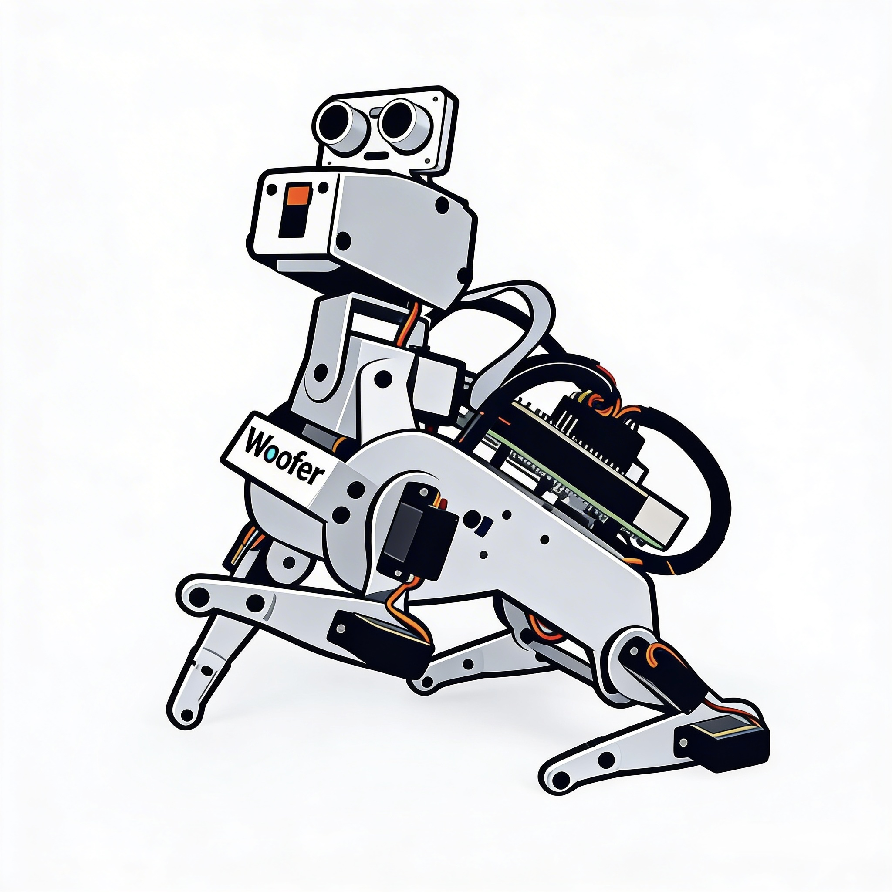

# :mouse: Welcome to Pi Dog (Woofer) Development

<p align="center">
 
</p>

<p align="center">
<i>The important thing is not to stop questioning.<br>
Curiosity has its own reason for existing.<br>
One cannot help hut he in awe when he
contemplates the mysteries of eternity, <br>of life, of
the marvelous structure of reality. <br>It is enough
if one tries merely to comprehend a little of this
mystery every day. <br>Never lose a holy curiosity.</i><br><br>
&nbsp; &nbsp; &nbsp; &nbsp; &nbsp; &nbsp; &nbsp; &nbsp; &nbsp;
&nbsp; &nbsp; &nbsp; &nbsp; &nbsp; &nbsp; &nbsp; &nbsp; &nbsp;
&nbsp; &nbsp; &nbsp; &nbsp; &nbsp; &nbsp; &nbsp; &nbsp; &nbsp;
&nbsp; &nbsp; &nbsp; &nbsp; &nbsp; &nbsp; &nbsp; &nbsp; &nbsp; ― ALBERT EINSTEIN
</p> 

https://www.sunfounder.com/?ref=lbsberjr

## Table of Contents
- [Description](#scroll-description)
- [Development Platform](#computer-development-platform)
- [Software Development](#floppy_disk-software-development)
- [Platform Tested](#iphone-platform-tested)
- [Screenshots](#film_strip-screenshots)
- [Chronology of Development Events](#hourglass_flowing_sand-chronology-of-development-events)
- [Buy Me a Coffee](#coffee-buy-me-a-coffee)
- [License](#page_with_curl-license)
- [Feedback and Suggestions](#speech_balloon-feedback-and-suggestions)

## :scroll: Description
My own code development on Sunfounder Pi Dog with Raspberry Pi 5. \
The program runs on Raspberry Pi 5 with Sunfounder Pi Dog robotics hardware.

## :computer: Development Platform
I have tested on Raspberry Pi 5 running Thonny.

On the Raspberry Pi 5:
1. Open Thonny and upload the files in the repository pi_dog_woofer.py onto Raspberry Pi 5. Program is using Python.
2. Open the file pi_dog_woofer.py
3. Run pi_dog_woofer.py

## :floppy_disk: Software Development:
Both programs are generated by DeepSeek AI in MicroPython using the following prompt:
    
Some useful information:
``` 
Servos Order
                     4,
                   5, '6'
                     |
              3,2 --[ ]-- 7,8
                    [ ]
              1,0 --[ ]-- 10,11
                     |
                    '9'
                    /

    legs pins: [2, 3, 7, 8, 0, 1, 10, 11]
        left front leg, left front leg
        right front leg, right front leg
        left hind leg, left hind leg,
        right hind leg, right hind leg,

    head pins: [4, 6, 5]
        yaw, roll, pitch
		PiDog Head Movement Axes
		- Yaw (No. 4 servo): Rotates the head left and right (turning).
		- Roll (No. 6 servo): Tilts the head side-to-side (ear-to-shoulder).
		- Pitch (No. 5 servo): Moves the head up and down (nodding).
		Example:
			shake_head = [[30, 0, 0],[-30, 0, 0]]
			nod_head = [[0, 0, 30],[0, 0, -30]]

    tail pin: [9] 

```
## :iphone: Platform tested:
I have tested my code on:
- Raspberry Pi 5

## :film_strip: Screenshots
<p float="left">
  
</p>

## :hourglass_flowing_sand: Chronology of Development Events
- 8th Apr 2026: Received Sunfounder Pi Dog late afternoon and started putting together Tutorial 1. (https://youtu.be/PTo6smSIlDY?si=NVm-82xS5lq4eu3_/)
- 9th Apr 2026: Completed Tutorial 2 assembly. When at step 56 of assembly found that there was a missing servo. Contacted Sunfounder for the missing servo and they will send out a replacement tomorrow. In the mean time luckily i had bought my own servo last time. So i have used my micro servo to continue with assembly. (https://youtu.be/witCWeoHTdk?si=lcg9SfJRhg2cmcER/)
- 14th Apr 2026: Learning Python threading. (https://realpython.com/intro-to-python-threading/)
- 15th Apr 2026: Implemented the autonomous roaming around and obstacles avoidance functions. <br>
I tried to use Vosk STT to recognise voice command but it is buggy. Not a single time voice command words are recognised correctly. <br>
My code mainly reference to the SunFounder forum post below:<br>
(https://forum.sunfounder.com/t/subsumption-model-for-pidog/3545)<br>
Stephen Smith's Blog on "How to Program a SunFounder PiDog" is always quite helpful.<br>
It uses image capture for autonomous tracking.
(https://smist08.wordpress.com/2024/02/09/how-to-program-a-sunfounder-pidog/)
## :coffee: Buy Me a Coffee
If you appreciate my work, do support me by...<br>
<a href="https://www.buymeacoffee.com/chanlhock" target="_blank"></a>
<br>If you're interested in purchasing Sunfounder products please use my referral link below:
https://www.sunfounder.com/?ref=lbsberjr

## :page_with_curl: License
```
This program is licensed under the GNU General Public License v3.0 
Permissions of this strong copyleft license are conditioned on making  
available complete source code of licensed works and modifications,  
which include larger works using a licensed work, under the same  
license. Copyright and license notices must be preserved. Contributors  
provide an express grant of patent rights.
```
See the [GNU General Public License](LICENSE) for more details.

## :speech_balloon: Feedback and Suggestions
For any feedback or suggestions, feel free to contact me via email:\
:email: chanlhock@gmail.com :mouse:
